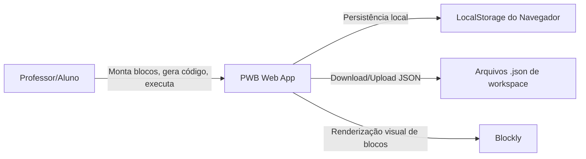
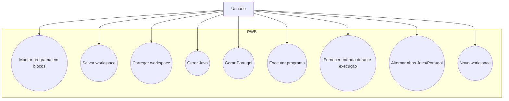
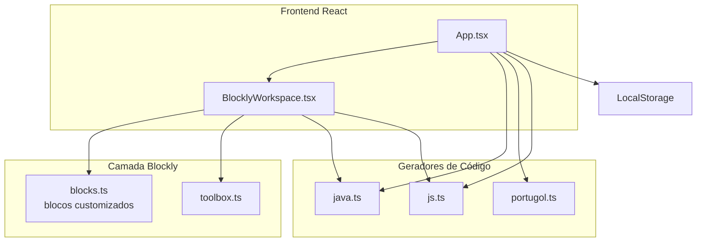
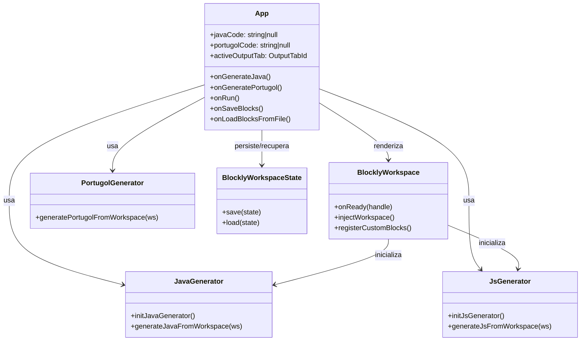
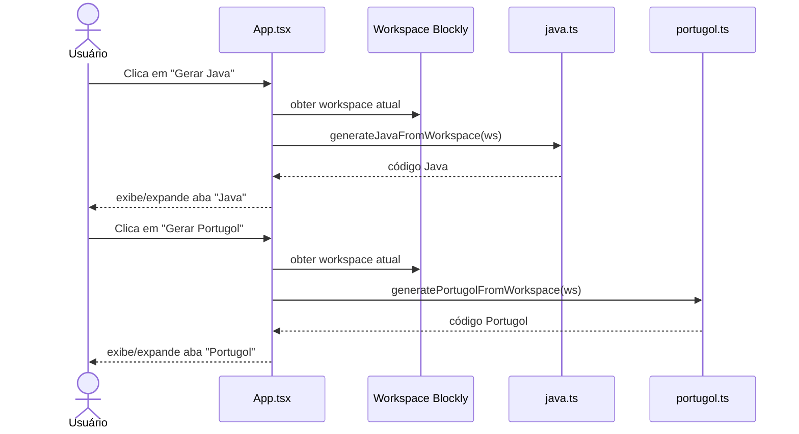
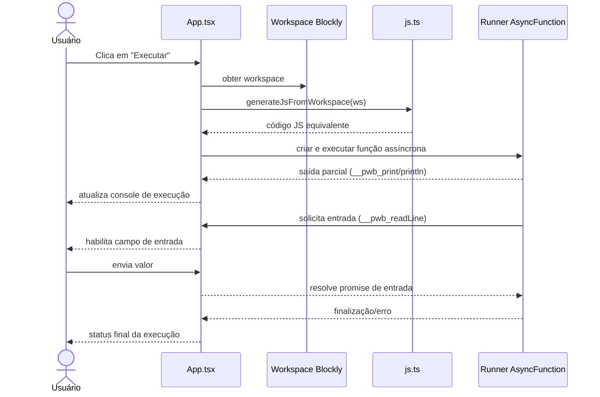
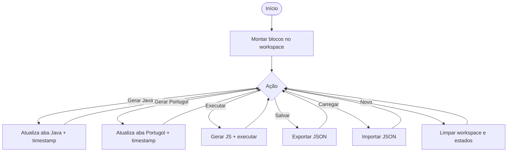

# Modelagem do Sistema PWB (Programming With Blockly)

Este documento descreve a modelagem do sistema atual (React + Blockly + geradores Java/Portugol + execução via JS).

## 1) Diagrama de Contexto

## 2) Diagrama de Casos de Uso

## 3) Diagrama de Componentes (Arquitetura)

## 4) Diagrama de Classes Lógicas (Modelo de Domínio Técnico)

## 5) Diagrama de Sequência: Gerar Código (Java/Portugol)

## 6) Diagrama de Sequência: Execução (interpretada via JS)

## 7) Diagrama de Atividade: Fluxo Principal do Usuário

## Observações de modelagem

- O sistema é 100% client-side no estado atual.
- A execução usa tradução para JavaScript e um runner assíncrono local.
- Java/Portugol são saídas de geração (não compilação/execução real dessas linguagens).
- Persistência de workspace usa LocalStorage + arquivo JSON.
